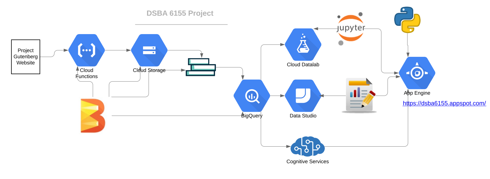

#  Overfitters Anonymous

| Abhijeet | Kevin|Janani|Mansi|Riddhi
|---|---|---|---|---|

1. **Research question**:  
   - Distinctions between Pre-abrahamic vs Abrahamic religions
   - Geography/Demographics by religion
   - What do different religious books agree/disagree on?
   - Evolution of themes in the texts over time/ change of tone / language / concepts
   - Leverage text analytics/ word vectors to search for similar ideas in different books, compare and contrast them

- **Audience**: Theologians, Anthropologists, Religious scholars, Researchers, Curious people, &c.

2.  **Domain and Data**:

  * **Data**:
    Religious texts will be downloaded from the Project Gutenberg website. Project Gutenberg is an online archive of books that are free to download and distribute.
    * Project Gutenberg
      - https://www.gutenberg.org/ebooks/10
      - http://www.gutenberg.org/ebooks/2800
      - http://www.gutenberg.org/ebooks/3283
      - http://www.gutenberg.org/ebooks/35895
      - http://www.gutenberg.org/ebooks/17
      - http://www.gutenberg.org/ebooks/2680
    * World Religion Data:
      - https://data.world/cow/world-religion-data
      - https://data.world/ian/world-religious-populations
   
    * **Architecture**
      
      - Access has been given to Dr Thompson as a reader to the project- dsba6155 in gcp
      - Cloud Functions - We have the [Python Script](https://github.com/abhijeetdtu/dsba6155project/blob/master/dsba6155project/data_pull/gutenberg.py) ready that pulls books from project gutenberg. It needs to be hooked to cloud functions
      - Cloud Storage - **kbs_bookstore** - stores the intermediate books downloaded from Project Gutenberg
      - App Engine - **default**- App Service is hosting the Frontend of the project
      - **Bigquery** 
         - This has a dataset - nlp so far with only one table - wordcounts - which was populated using - [Apache Beam](https://github.com/abhijeetdtu/dsba6155project/blob/master/dsba6155project/data_pull/parallel_beam.py)
         
         
    a) **Preprocessing**
      - Creating Corpus
        - Cleaning
        - Tokenization
        - Lemmatization
        - TF/IDF
      - Word To Vector Embeddings

    b) **Size of data**
      - Very high dimensional text analysis
      - Depends on number of books we end up incorporating/ingesting

    c)  **Tentative Plan for Analysis on GCP**

      1. **EDA and Preprocessing**
           - Use Apache Beam to Scrape Data
           - Google Storage Bucket for staging data
           - Data Studio for EDA/Visualization/Reporting

      2.  **Dashboard for User group, Dashboard for Data Engineers**
           - Data Studio Dashboard - User Group
               - We are planning to build an GCP App Engine web frontend hosted [here](https://dsba6155.appspot.com/)
               - We are going to use Python Dash and Google Data studio to embed dashboards in the web app to provide seamless storytelling
           - Datalab Jupyter Notebook & Data Studio Dashboard - Data Engineers

      3.  **GCP further processing - ML**
         - Google AI platform and Google Datalab to create notebooks to perform analytics, data mining, text processing.

      4. **Evaluation of results**
         - We might use cluster evaluation methods such as ‘within cluster MSE’ to evaluate the fitness of the clusters of topics/themes.

      5.  **Steps for production model**
        - Word to Vector conversions
            -   Pymagnitude
            -   Scipy
            -   Gensim
            -   Google BERT
        
           - Model to find similar concepts and themes
           - Flask API as an interface between model and webapp
           - Webapp to enable easy search and exploration of similar concepts across religions

      6. **Final Dashboard for User Group**
           - An interactive app that presents the insights that we have gained.
           - One of the interactions the user will be able to do with the dashboard is input keywords they want to search for in the texts to get an insight into what opinion each religion holds.
           - Maybe, a separate web app(Google App Engine)/R-shiny app to enable interactive exploration.

* **Research Papers**
  - https://arxiv.org/pdf/1912.10847.pdf
  - [Designing Cloud Architectures](https://docs.huihoo.com/amazon/aws/whitepapers/AWS-Cloud-Architectures.pdf)
  - [Text Mining In Cloud](https://link.springer.com/article/10.1007/s10586-017-0909-1)
  - Helper Blogs
      - [Cloud NLP](https://medium.com/google-cloud/sentiment-analysis-using-google-cloud-machine-learning-552be9b9c39b)
      
  - The above research papers along with the cousera course will help us understand what all services can be leveraged in GCP to efficiently develop an end to end system. As we plan to utilize a variety of services from GCP including Cloud functions, Cloud Storage, BigQuery , Data Studio And App Engine, it becomes imperetive to be able to design the system correctly so that all the different pieces can fit together seamlessly. Therefore we would rely on the information in the research papers to be able to design the architecture. Also since the main aim of the project is to do text analytics, we would also want to be aware of best practices and shorthands available to us in cloud environment. There are also many blogs out there which help quickly figure out specific ways to achieve a short goal and therefore move forward. We aim to utilize these resources to come up with a solution that can provide insights into the structures of religious texts.

### Getting the data

* Getting the text files with a cloud function
    - 
    
* Using Apache Beam with Cloud Dataflow to process the text files
   - 

### EDA Dashboards for books
- [Link to Dashboard](https://datastudio.google.com/reporting/d07c9d8e-2d34-4117-ac78-383505cf1eab)
- 
- 

- We also have some tableau exploration results [Here](https://github.com/abhijeetdtu/dsba6155project/blob/master/TableauResults.md)
- Pre Abrahamic Books Vs Abrahamic Books
   - [Link to Jupyter Notebook](https://colab.research.google.com/drive/1vv3QoIDkaJmnt2opQ9auclM2BBny-nUG)
   - 
   
### Sentiment Analysis
  - [Link to Dashboard](https://datastudio.google.com/reporting/c8f90611-a6f6-4c0d-8440-2bedf7efd2ac)
  - 
  - 
  
  

### Modelling Results
   - [Link to Interactive Playground](http://projector.tensorflow.org/?config=https://raw.githubusercontent.com/abhijeetdtu/dsba6155project/master/dsba6155project/analysis/projector_tensor_vis.json)
         * P.S - Please give it a minute to load
   - We created a model that learns word embedding using Keras and Tensorflow
   - Example result
      - 
   

### Conclusions
   - Distinctions between Pre-abrahamic vs Abrahamic religions
      - We could see that on using TF-IDF on wikipedia articles and running PCA, books of two categories clustered in distinct regions
   - Geography/Demographics by religion
      - From the geo maps we could see that Ancient regions/countries like India, Jerusalem, Egypt showed up across different religions
   - Evolution of themes in the texts over time/ change of tone / language / concepts
      - 
      - In the image above where each dot is a different version of Bible, we could see that the differences in the versions over time are explained by PC0, but problem with principal component analysis is that it's difficult to pin point what exactly PC0 composed of
   - Leverage text analytics/ word vectors to search for similar ideas in different books, compare and contrast them
      - We leveraged sentiment analysis to compare different books
         - 

      
* **Evaluating   Machine  Learning  Projects:  Forty  Three  Rules  of  Machine  Learning**

   - Most  of  the  gains  come  from great features and not great machine learning algorithms.As the article begins by saying that we should have a reasonable objective and that the end to end pipeline should be solid, for us the implications are from the creation of the infrastructure resources to loading, processing and then using data, all the steps should be automated as much so that they are repeatable. For this, we have leveraged - **Terraform and Google technologies like Apache beam** that seamlessly integrate with GCP.

   **Rule#1**- Don’t be afraid to launch a product without machine learning.
      - Rule 1 is of particular interest as it boldly states that we should not hesitate in launching a product without ML. What this means for our project is that we will focus on iteratively improving on simpler versions of our end goal. Adding layers as we go.

   **Rule #4**: Keep the first model simple and get the infrastructure right.
      - As the rule says, we will first focus on implementing a solid pipeline and begin by implementing a simple baseline model and then focus on enhancing our model to boost performance.

   **Rule#5**: Testing Infrastructure independently from machine learning
      - Since we are leveraging apache beam and terraform it becomes easier to test the infrastructure components without having to test the machine learning pieces. We can use the terraform plan phase to see if it is going to create the resources we need. Similarly, we can test our apache beam pipeline with just a few files to see that the data is correctly processed and transformed.

   **Rule# 16**:  Plan to launch and iterate.
      - For our text mining approach, we need to first choose the textual features and then decide on how to quantify the similarity of the documents/books. After having converted each document into a vector, we will evaluate how good those document vectors are. There are many ways to convert documents to vectors and even more ways to quantify similarity, therefore instead of trying all possible ways we pick one based on our initial research and similar past projects. Following through and looking at final results, if we don’t get satisfactory results we will reiterate and try a different approach.

   **Rule#36** - Avoid feedback loops with positional features
      - For our text mining project, this rule implies that we should have features that are not as crude as a simple bag of words. We might want to add more informative features by using algorithms for Part of Speech tagging and Entity extraction that will not just give what words were present in a book, but also provide syntactic and semantic information.

   **Rule#41** - When performance plateaus, look for qualitatively new sources of information to add rather than refining existing signals.
      - This is a very common problem, and although we haven’t got there yet for this project, the advice offered in the article is sound. We should be adding more/better features to the data than trying to transform or enhance the existing features. This rule will come handy when we would be evaluating the document/book similarities.
